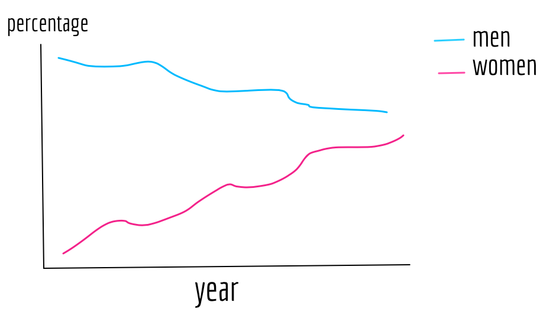
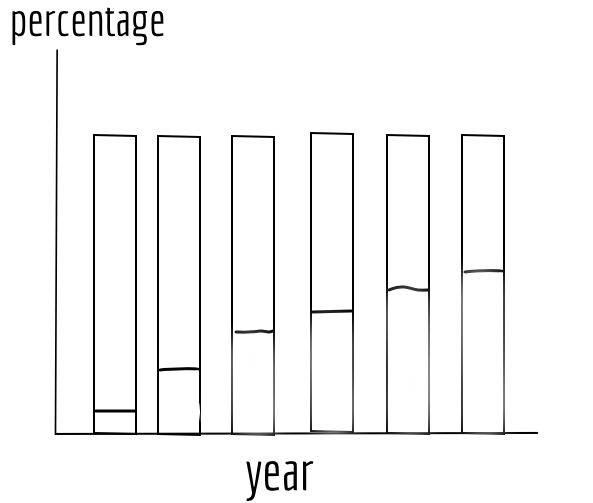
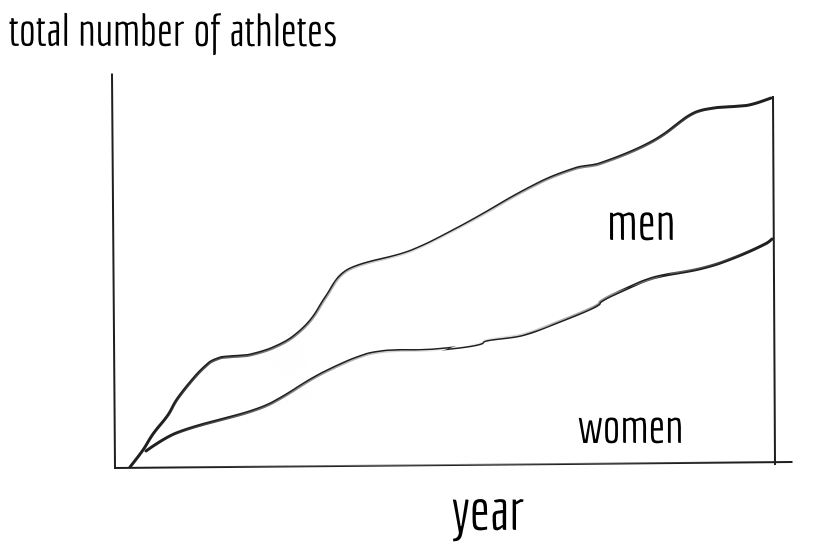
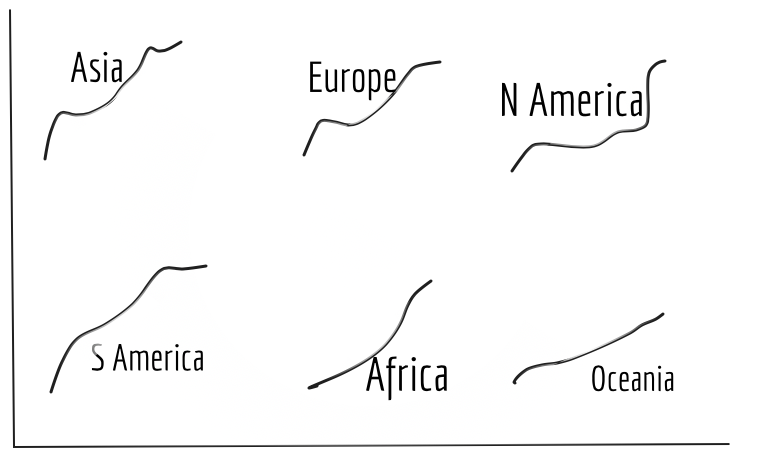
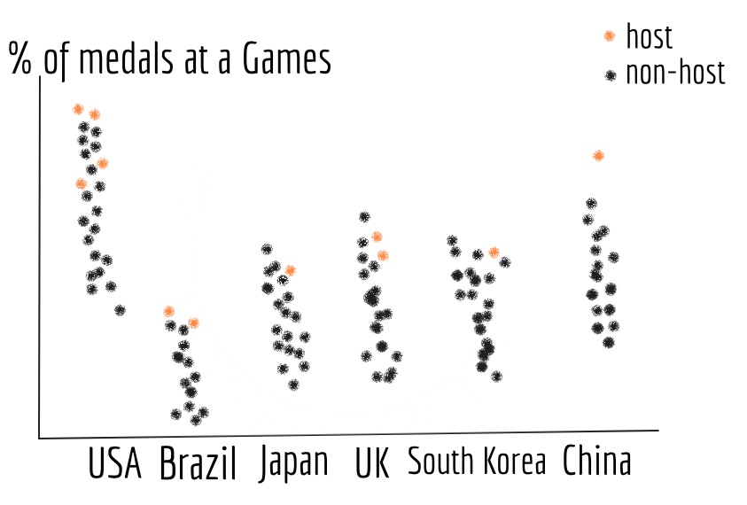
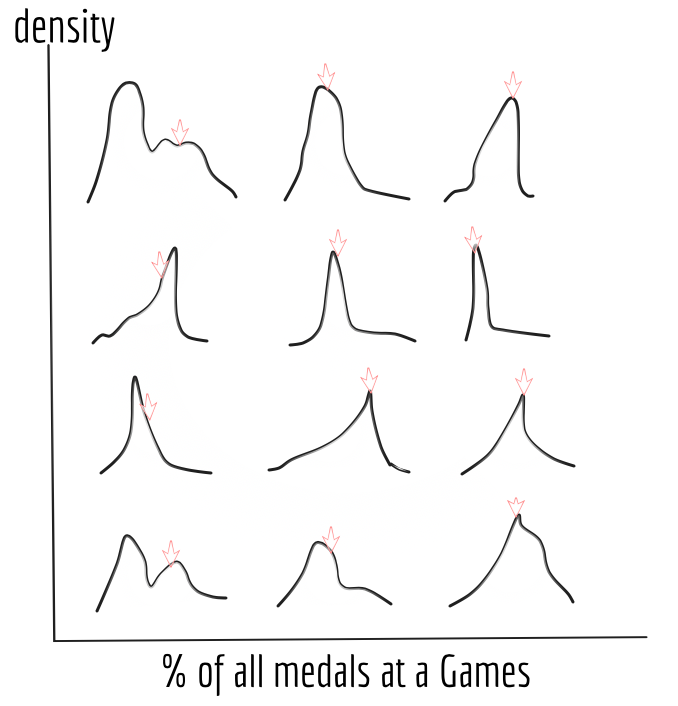
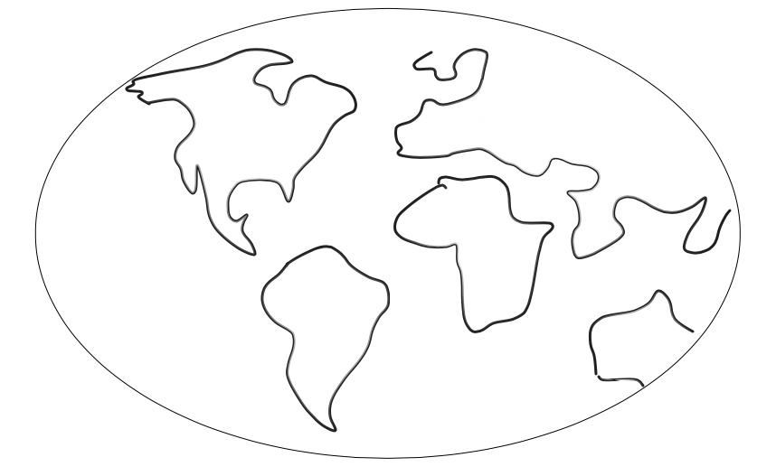
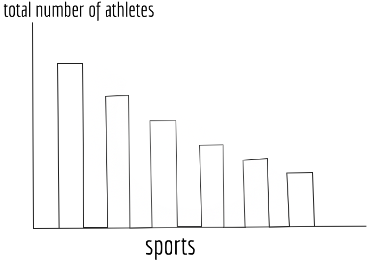
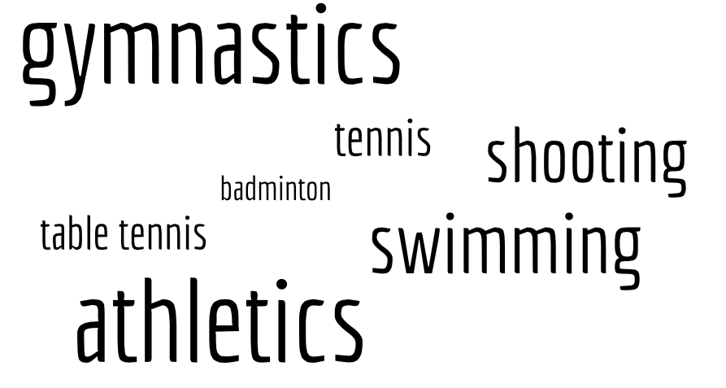

# Plans{#plans}

In the following, we'll detail our plans for making visualizations.  

## Female Participation{#plans-female}

As discussed above, we will use a line graph, stacked bar chart, and area chart to show the overall trend of female participation in the Summer Olympics. For female participation in each individual continent, we will use KDE in a small multiple. 

In a line graph, the x-axis will be time and the y-axis the percentage against the total number of participants. We will show both female and male athletes. See Figure \@ref(fig:figure12).

For stacked bar charts, the x-axis will be time and y-axis percentage against the total number of athletes. Two segments in each bar will represent male and female respectively, and the two will sum up to 100% for every year presented. This will make the comparison between male and female participation very clear. See Figure \@ref(fig:figure13).

```{r figure12, echo=FALSE, fig.align='center', fig.cap='Line graph for female participation', out.width='85%'}

```

```{r figure13, echo=FALSE, fig.align='center', fig.cap='Stacked bar chart for female participation', out.width='75%'}

```

In order to also show the changes in the total number of athletes, beside the changes in percentages, we will use a stacked area chart. The x-axis will be again time, and the y-axis will be the total number of athletes for each Olympic Games. See Figure \@ref(fig:figure14).

For female participation in each individual continent over the years, we will line graphs in a small multiple. The x-axis will be time and the y-axis will be the percentage of female athletes against the total number of athletes. To make comparisons between continents and with the global average clearer, for each plot in the small multiple, we will put the line graph of other continents in the background, and we will also plot the global average as the benchmark. See Figure \@ref(fig:figure15).

```{r figure14, echo=FALSE, fig.align='center', fig.cap='Staked area chart for female participation', out.width='75%'}

```

```{r figure15, echo=FALSE, fig.align='center', fig.cap='Line graph in small multiple for female participation', out.width='75%'}

```

## Home-field Advantage{#plans-homefield}

To examine whether there exists a home-field advantage at the Olympics, we will first use a scatter plot with jitter. The x-axis will be countries that have ever been a host, and the y-axis will be the percentage against the total number of medals a country earned. Each dot represents an Olympic Games the country has participated in. Black dots denote data for a “non-host” year and orange dots denote data for host year. See Figure \@ref(fig:figure16).

To better show the density distribution of medal gains, we will employ kernel density estimation in a small multiple. The x-axis will be the percentage against the total number of medals at a Games and the y-axis will be density. We will use an arrow to denote the density of a year when the country was a host. See Figure \@ref(fig:figure17).

Arrows located at points with high densities, would be signs of the existence of home-field advantage at the Olympics.

```{r figure16, echo=FALSE, fig.align='center', fig.cap='Scatter plot with jittering for home-field advantage', out.width='80%'}

```

```{r figure17, echo=FALSE, fig.align='center', fig.cap='KDE for home-field advantage', out.width='75%'}

```

## Medal Efficiency{#plans-medal-efficiency}

The index of “medal efficiency” will be calculated as medal points per athlete participating. We will use an interactive choropleth world map to show each participating country and region’s score. See Figure \@ref(fig:figure18).

```{r figure18, echo=FALSE, fig.align='center', fig.cap='Choropleth map for medal efficiency', out.width='95%'}

```

## Ranking Sports{#plans-ranking}

First, we will use a bar chart where the x-axis will be the different sports and the y-axis the corresponding number of athletes. See Figure \@ref(fig:figure19). 

Second, we will show this ranking using a word cloud in which larger font size denotes a higher number of participants. This graph will be clearer and more direct because viewers can intuitively get a sense of the relative size of participation of a sport.  See Figure \@ref(fig:figure20).

```{r figure19, echo=FALSE, fig.align='center', fig.cap='Bar chart for sports ranking', out.width='85%'}

```

```{r figure20, echo=FALSE, fig.align='center', fig.cap='Word cloud for sports ranking', out.width='85%'}

```

