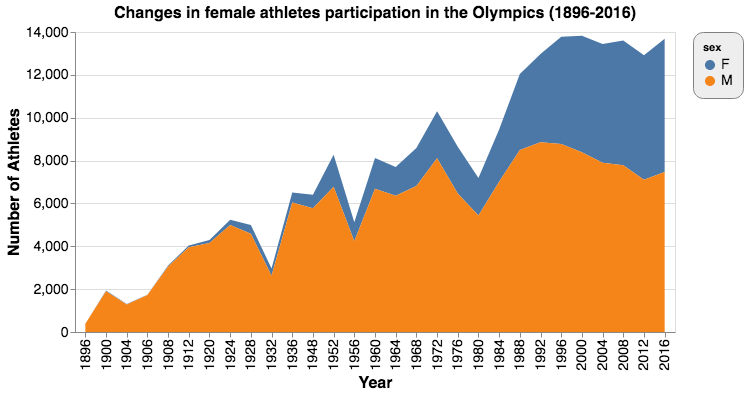

# Plots{#plots}

In the following, we'll show the final plots based on our plans. 

## Female Participation over Time{#plots-female-time}

As planned above, we started with a simple line graph displaying both male and female athletes’ percentage against all athletes. The strength of this method is that it is simple and clear. It shows that the female percentage has been steadily growing in the past century at the Olympics. The drawback is that it does not generate a stark contrast between male and female as a stacked bar chart can do. See Figure \@ref(fig:figure21).

```{r figure21, echo=FALSE, fig.align='center', fig.cap="Line graph for changes in female participation", out.width='100%'}

```

We then used stacked bar graphs. We first tried stacking the bar horizontally with percentage on the x-axis and time on y-axis. See Figure \@ref(fig:figure22).

```{r figure22, echo=FALSE, fig.align='center', fig.cap="Horizontal stacked bar chart for changes in female participation", out.width='100%'}

```

It was not as beautiful as we wanted, so we tried to put it upright and replace the axis labels. To highlight the trend, we set the male section grey and the female part bright blue. We also drew a red line at the intersection of the two parts. This time, female participation was obviously highlighted and the trend shown very clearly. See Figure \@ref(fig:figure23).

```{r figure23, echo=FALSE, fig.align='center', fig.cap="Vertical stacked bar chart for changes in female participation", out.width='100%'}

```

However, as discussed above, stacked bar charts can only show the changes in percentages, not those in the actual number of participants. To also visualize how the total number of athletes participating in the Olympics changed over the century, we opted for a stacked area chart. See Figure \@ref(fig:figure24).

```{r figure24, echo=FALSE, fig.align='center', fig.cap="Stacked area chart for changes in female participation", out.width='100%'}

```

The x-axis denotes time and the y-axis number of athletes. Areas are made up of male and female participants. The two added up to the total number of athletes. This stacked area chart not only shows the changes in female participation, it also displays how the total number of athletes has been increasing over the years. The drawback is that area is not a much preferred visual encoding. As a result, the comparison of percentages of male and female is not very accurate. That said, we think its strengths outweigh its disadvantages.

## Female Participation Across Continents{#plots-female-continents}

To visualize changes in female participation in each continent, we first used a simple line graph where we put all the continent together. The x-axis is time, and the y-axis is female participation. The legend shows the colors associated with the continents. See Figure \@ref(fig:figure25).

```{r figure25, echo=FALSE, fig.align='center', fig.cap="Line graph for female participation by continent", out.width='100%'}

```

The graph was very messy. As there were six continents and one global average, we could not distinguish between the seven categories very easily. So we gave up this option. 

Then we tried a small multiple in which each continent and the global average were shown in simple line graphs. This chart showed every continent clearly but it was not very easy to make a comparison. See Figure \@ref(fig:figure26).

```{r figure26, echo=FALSE, fig.align='center', fig.cap="Line graph in small multiple for female participation by continent", out.width='100%'}

```

To make comparisons clearer, we decided to use an area chart. We stacked each area chart each representing a continent along a vertical line. However, comparisons were still difficult. Most importantly, in terms of using color as the visual encoding, this graph has too many categories. Besides, it has red and green at the same time, and therefore is not accessible to colorblind populations. See Figure \@ref(fig:figure27).

```{r figure27, echo=FALSE, fig.align='center', fig.cap="Stacked bar chart for female participation by continent", out.width='80%'}
knitr::include_graphics('static/pics/g-2-4_new.png')
```

We then went back to the small multiple. Since we cared about the comparison between each continent, we decided to plot every continent and the global average in each of the six graphs. We highlighted only one continent in each graph, and set all other continents grey in the background. It worked much better than out earlier attempts, but one drawback is that it did not allow comparison with the global average. See Figure \@ref(fig:figure28).

```{r figure28, echo=FALSE, fig.align='center', fig.cap="Line graph in small multiple for female participation by continent against all other groups", out.width='100%'}

```

Finally, we decided to highlight the global average with a black line. This time, comparisons both between continents and with the global average were clear. See Figure \@ref(fig:figure29).

```{r figure29, echo=FALSE, fig.align='center', fig.cap="Line graph in small multiple for female participation by continent against global statistics", out.width='100%'}

```

## Home-field Advantage{#plots-homefield}

As discussed above, we first tried scatter plot with jitter. The x-axis is the countries that have ever hosted the Olympics and the y-axis denotes the percentage of medals earned by a country against the total number of medals in that year. Blue dots represent data when the country was not the host and the orange ones for when it was the host. See Figure \@ref(fig:figure30).

```{r figure30, echo=FALSE, fig.align='center', fig.cap="Scatter plot with jittering for home-field advantage", out.width='100%'}

```

The blue dots were too packed. We later tried beeswarm plot coupled with box plot. Dots were shown much more clearly but one drawback is that we could not see the density distribution of all the dots very well. Density distribution was important in this case because it would allow an easier comparison between the medal percentage when a country was a host and that when it was not. See Figure \@ref(fig:figure31). 

```{r figure31, echo=FALSE, fig.align='center', fig.cap="Beeswarm plot for home-field advantage", out.width='100%'}

```

To show density distribution of medal percentages, we used kernel density estimation in a small multiple. The x-axis is the medal percentage and the y-axis is the probability density. We used a red arrow to denote when the country was an Olympics host. An arrow located at the tail would indicate the existence of home-field advantage. See Figure \@ref(fig:figure32).

```{r figure32, echo=FALSE, fig.align='center', fig.cap="KDE in small multiple for home-field advantage", out.width='100%'}

```

## Medal Efficiency{#plots-medal-efficiency}

As planned, first of all, we did data manipulation before plotting. Golds were given 4 points, Silver 2, and Bronze 1. Attendance without any medals was assigned to 0 point. A country’s “medal efficiency” was calculated as the quotient of total medal points and the total number of athletes participating over 120 years. Therefore, if a country/region has a medal efficiency of 0.5, it means that on average, each athlete of that country/region earned half a Bronze. 

We then plotted a choropleth map using orthographic projection. We applied Viridis color map where darker shades denote higher medal efficiency. To ensure interactivity, we made this map with the Plotly package. See Figure \@ref(fig:figure33).

```{r figure33, echo=FALSE, fig.align='center', fig.cap="Interactive choropleth for medal efficiency", out.width='100%'}

```

We found this index both more accurate and intuitive. The reasons why it is more accurate have been outlined above. We believe that it is also more intuitive because, for example, for countries that still exist today, the highest medal efficiency is 0.91 for the United States of America. The fact that the highest is close to one makes it easier to compare between countries. 

## Ranking Sports{#plots-ranking}

To rank sports according to the number of athletes, we first plotted a bar chart, each bar representing a category. As can be seen below, since there were too many categories, the names of sports overlapped to a degree that most of them were indistinguishable. Since there are around thirty sports, using colors is not an ideal option. 

We then thought about the word cloud. In word clouds, the size of words is associated with the frequencies. This would make our ranking clearer. We did this visualization with the `wordcloud` package. See Figure \@ref(fig:figure34).

```{r figure34, echo=FALSE, fig.align='center', fig.cap="Word cloud of sports ranking by number of participants in all past Summer Olympics", out.width='100%'}

```
